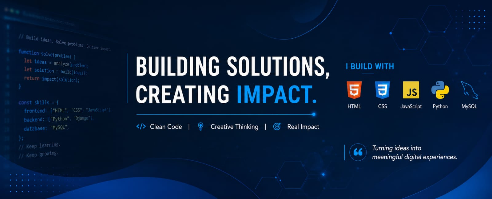

  

<h1 align="center">
  Hi 👋, I'm Nosrat Jahan Mohima
</h1>

<h3 align="center">
  CSE Student | Machine Learning Enthusiast | Web Developer | Research Learner
</h3>

  

  

 👩‍💻 About Me

- 🎓 I am a Computer Science and Engineering student.
- 🔬 Currently working on **XAI with Machine Learning to Predict Diabetes Type**.
- 🤖 Interested in **Machine Learning, Explainable AI, Computer Vision, and Web Development**.
- 🌱 Learning and improving my skills in **Python, JavaScript, MySQL, and AI-based projects**.
- 💡 I love building practical solutions that create real impact.
- ⚡ Fun fact: I am funny and always curious to learn new things.

 🚀 Current Focus

- 🩺 Diabetes prediction using Machine Learning and XAI  
- 👁️ Real-time suspicious activity / intrusion detection  
- 🌐 Frontend and backend development basics  

 🛠️ Languages and Tools

  

🌐 Connect with Me

  

  

  

  

🏆 GitHub Trophies

  

 📊 GitHub Stats

  

  

  

  

 📈 Contribution Activity

  

 ✨ Motto

  

  

